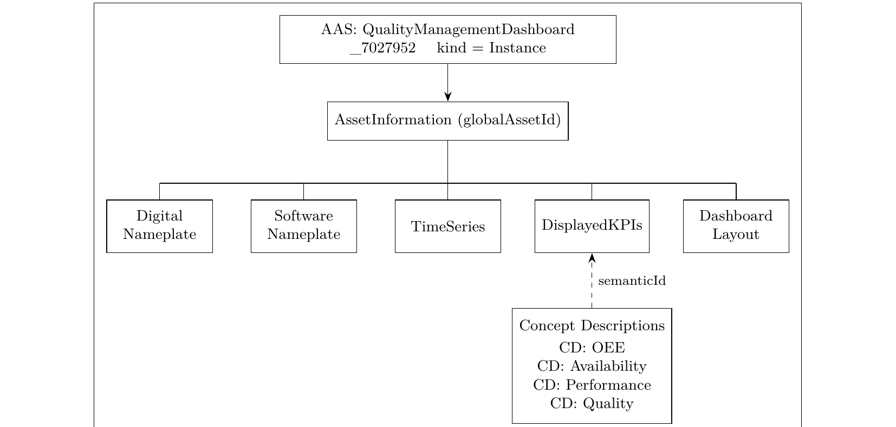

<h1 align="center">
Digital Asset AAS - Quality Management Dashboard
</h1>
<br>

<p align="center">
<a href="https://www.idta.org"></a>
<a href="https://www.eclipse.org/basyx/"></a>
<a href="https://en.wikipedia.org/wiki/RAMI_4.0"></a>
</p>

Individual coursework project (Digitalization of ICPS, SS2026, Hochschule Emden/Leer) modeling a factory quality-monitoring dashboard as an Industrie 4.0-compliant **Asset Administration Shell (AAS)**, deployed live as a Type 2 shell on Eclipse BaSyX.

---

## Overview

The Digital Factory at Hochschule Emden/Leer runs three production modules - an Injection Moulding Machine (IMM), a laser engraver, and a delta robot - each exposing process data through its own OPC UA server in its own format. Quality indicators, especially Overall Equipment Effectiveness (OEE = Availability x Performance x Quality Rate), depend on data scattered across all three. A Quality Management Dashboard consolidates these sources into one consistent view for operators and supervisors.

This project models that dashboard **as an AAS** - not as a passive data container, but as a **tool with capabilities**: the submodels record which quality KPIs the dashboard shows, where its data comes from, and how it presents that information, while the authoritative measurements stay in the underlying machine systems.

The AAS was built first as a **Type 1 AASX package** (AASX Package Explorer) and then deployed as a **Type 2 shell** on Eclipse BaSyX, where it runs as a live service with all submodels readable over a standard REST API.

---

## Repository Structure

```
.
├── README.md
├── LICENSE
├── aas-core-submodels-diagram.png     # AAS core + submodel structure
├── aasx/
│   ├── QualityManagementDashboard_7027952.aasx   # Type 1 AASX package
│   └── aas-full-export.json                       # Whole AAS environment in one file
└── submodels/
    ├── digital-nameplate.json
    ├── software-nameplate.json
    ├── time-series.json
    ├── displayed-kpis.json
    ├── dashboard-layout.json
    └── concept-descriptions.json      # 81 total: 4 custom OEE + 77 standard IDTA/eCl@ss
```

---

## Architecture

<p align="center"></p>

The AAS core references five submodels. `DisplayedKPIs` additionally links out to four custom Concept Descriptions through `semanticId`, so every OEE property carries a formally resolvable meaning rather than relying on a name convention alone.

The primary use case - an external MES or Industrie 4.0 component discovering the dashboard's capabilities and reading live KPIs - follows this sequence:

1. `GET /submodels` - discover which submodels exist (the dashboard's capability description)
2. `GET /submodels/{DisplayedKPIs-id-base64}/submodel-elements` - retrieve current KPI values
3. `GET` the Concept Description behind any property's `semanticId` - resolve its exact meaning (unit, data type, definition) with no vendor-specific documentation needed

---

## Submodels

### a) Digital Nameplate (IDTA 02006)

Provides the asset's identity metadata - the entry point for automated asset lookup. Key populated values in this instance:

| Property | Value |
|---|---|
| ManufacturerName | Hochschule Emden/Leer |
| ManufacturerProductDesignation | Quality Management Dashboard |
| ManufacturerProductFamily | Quality Dashboards |
| ManufacturerProductRoot | Digital Factory Dashboards |
| SerialNumber | QMD-2026-001 |
| YearOfConstruction | 2026 |
| DateOfManufacture | 2026-05-18 |
| SoftwareVersion | 1.0.0 |
| CountryOfOrigin | DE |
| URIOfTheProduct | `https://hs-emden-leer.de/ids/asset/QualityManagementDashboard_7027952` |

### b) Software Nameplate (IDTA 02007)

Adds software-specific metadata, split into a **Type** section (properties shared by the software product in general) and an **Instance** section (deployment-specific details for this running copy): installed version, host, operating system, installation path. Together with the Digital Nameplate, this gives a complete machine-readable identity record for the software asset.

### c) TimeSeries (IDTA 02008)

Stores historical KPI records using the **LinkedSegments** pattern - each machine gets its own segment referencing an external REST endpoint, rather than the AAS embedding raw history inline:

| Segment | Endpoint pattern | Sampling interval |
|---|---|---|
| `LinkedSegment_IMM` | `.../api/v1/machines/IMM/metrics` | 60s |
| `LinkedSegment_LaserEngraver` | `.../api/v1/machines/Laser/metrics` | 60s |
| `LinkedSegment_DeltaRobot` | `.../api/v1/machines/Robot/metrics` | 60s |
| `InternalSegment` | (reserved for inline records, unused in this instance) | - |

Each segment additionally carries `RecordCount`, `StartTime`/`EndTime`, `Duration`, and `State`, so a consumer can tell how much history is available before querying it. Records themselves follow a long-format schema (`Time`, `MachineId`, `MetricName`, `Value`, `Unit`) - one schema accommodates all three machines without a separate structure per source.

### d) DisplayedKPIs (custom)

The capability description at the heart of this AAS - organized into three collections:

**QualityOverview** - plant-level rollup:

| Property | Example value |
|---|---|
| PlantOEE | 84.3 |
| PlantQualityRate | 97.0 |
| OverallYield | 98.4 |
| TotalGoodParts | 3560 |
| TotalDefects | 57 |
| ReportingPeriod / LastUpdated | 2026-05-28 |

**PerMachineQuality** - one entry per machine, each with `MachineId`, `LastUpdated`, a `ModuleStatus` block (`Status`, `IsConnected`), a `Counts` block, and a `QualityIndicators` block:

| Machine | Counts | Quality indicators |
|---|---|---|
| InjectionMouldingMachine | GoodPartsCount, BadPartsCount | Full OEE breakdown: Availability, Performance, Quality, OEE |
| LaserEngraver | FinishedCardCount, RejectedCardCount | EngravingQualityRate |
| DeltaRobot | SuccessfulPicks, FailedPicks | PickSuccessRate |

The IMM's four OEE properties each carry a `semanticId` pointing to one of the four custom Concept Descriptions (see below) - the only place in this submodel where semantic linking is used, since the OEE pillars are the properties most likely to be consumed by an external system without prior context.

**QualityAlerts** - `ActiveAlertsCount`, `HighestSeverity`, `LastAlertTimestamp`, `LastAlertMessage`.

### e) DashboardLayout (custom)

Describes the UI configuration a rendering client would use to reconstruct the dashboard: global settings (`Title`, `Description`, `Version`, `Theme`, `RefreshIntervalSeconds`, `DefaultTimeRange`) plus a `Panels` structure grouped into four sections:

| Section | Panel | Chart type | Data source |
|---|---|---|---|
| OverviewSection | QualityOverviewPanel | StatPanel | `DisplayedKPIs.QualityOverview` |
| ComparisonSection | QualityRatePanel | BarChart | `DisplayedKPIs.PerMachineQuality` |
| ComparisonSection | GoodVsBadPanel | BarChart | `DisplayedKPIs.PerMachineQuality` |
| TrendSection | QualityTrendPanel | LineChart | `TimeSeries` |
| AlertSection | QualityAlertsPanel | Table | `DisplayedKPIs.QualityAlerts` |

Each panel names its data source by submodel/collection path, so a rendering client (or a different dashboard technology entirely) knows exactly which AAS element feeds which visual, without hard-coded UI logic.

---

## Concept Descriptions

The package carries **81 Concept Descriptions** in total (`submodels/concept-descriptions.json`). Seventy-seven are standard, auto-included definitions that ship with the IDTA Digital Nameplate, Software Nameplate, and TimeSeries templates (e.g. `ManufacturerName`, `SerialNumber`, `InstalledOnOS`, `RelativeTimePoint`) - these aren't authored per-project, they come bundled with the templates themselves.

The remaining **four are custom**, written specifically for this project to formally ground the OEE pillars using the IEC 61360 data specification template:

| Concept | Full definition |
|---|---|
| **OEE_Composite** | Overall Equipment Effectiveness is the composite manufacturing performance metric calculated as Availability x Performance x Quality. World-class OEE is typically considered 85% or above. Standard benchmark of manufacturing productivity. |
| **OEE_Availability** | The proportion of scheduled production time during which the machine was available for production. Calculated as `actual_run_time / planned_production_time`. |
| **OEE_Performance** | The ratio of actual production speed to the ideal/maximum speed. Calculated as `(ideal_cycle_time x total_count) / run_time`. |
| **OEE_Quality** | The proportion of good parts out of total parts produced. Calculated as `good_count / total_count`. |

All four use `DataType: REAL_MEASURE`, `Unit: %`, and are addressed under the `https://hs-emden-leer.de/ids/cd/OEE/` namespace. They're referenced from the DisplayedKPIs submodel's IMM OEE block via `semanticId`, so any consumer can resolve the exact calculation behind a value without vendor-specific documentation.

---

## Using This AAS in an Industrial Deployment

This package was built against Hochschule Emden/Leer's Digital Factory, but the AAS itself - the submodel structure, the semantic modeling pattern, the identifier scheme - is general-purpose. Reusing it for a real production line means swapping the machine-specific pieces while keeping that structure intact.

### 1. Deploy it on your own AAS server

Any IDTA-compliant Type 2 AAS server can host this package - Eclipse BaSyX, AASX Server, FA³ST, or similar. Two ways in:

- **Fastest:** upload `aasx/aas-full-export.json` (or the `.aasx` file next to it) directly through your server's import/upload endpoint. This restores the entire environment - the AAS, all five submodels, and all concept descriptions - in one step. Most Type 2 servers, BaSyX included, expose a REST endpoint or admin UI for exactly this; check your server's API documentation for the precise call, since the exact path varies by product and version.
- **Selective:** load individual files from `submodels/` one at a time if you only need specific capabilities - for example, deploying just `displayed-kpis.json` for a lightweight, KPI-only integration without the nameplate metadata.

### 2. Re-point the identifier namespace

Every ID in this package uses the `https://hs-emden-leer.de/ids/...` namespace with the `_7027952` instance suffix - that's this specific student instance. Before deploying in your own organization, do a find-and-replace across the JSON files to swap in your own domain (e.g., `https://yourcompany.com/ids/...`), so the identifiers correctly reflect your ownership and don't collide with the original.

### 3. Adapt DisplayedKPIs to your own machines

The `PerMachineQuality` collection currently models one IMM, one laser engraver, and one delta robot. Add, rename, or remove machine entries to match your own shop floor. Keep the same four-property OEE pattern (Availability, Performance, Quality, OEE) for any machine where you want the full breakdown; use a single quality-rate property where a partial breakdown is all that's available - exactly how the laser engraver and delta robot are modeled here.

### 4. Reconnect TimeSeries to your own historian

`TimeSeries` doesn't store history inline - it references external REST endpoints via the LinkedSegments pattern, one segment per machine. Point these references at your own historian or time-series database's API instead of the original backend used in this project.

### 5. Keep or extend the Concept Descriptions

The four OEE Concept Descriptions are standard IEC 61360 definitions, not specific to this factory - they're safe to reuse as-is in most manufacturing contexts, calculation formulas included. If you add your own custom KPIs, follow the same pattern: create a Concept Description with `PreferredName`, `Definition`, `DataType`, and `Unit`, then reference it from your property via `semanticId`.

### 6. Consume it from an MES or enterprise system

Once deployed, any system can read live values without a vendor-specific adapter:

```
GET /submodels/{base64-encoded-submodel-id}/submodel-elements
```

Resolve any property's meaning by following its `semanticId` to the matching Concept Description - no manual documentation lookup required on the consumer's side. This is the same interaction pattern shown in the Architecture section above: an MES discovers the dashboard's capabilities, reads current KPIs, and resolves their semantics, all without a custom integration.

---

## Identifier Scheme

All AAS and submodel identifiers use a consistent namespace:

- **AAS ID:** `https://hs-emden-leer.de/ids/aas/QualityManagementDashboard_7027952`
- **globalAssetId:** `https://hs-emden-leer.de/ids/asset/QualityManagementDashboard_7027952`
- **Concept Descriptions:** `https://hs-emden-leer.de/ids/cd/OEE/...`

Each submodel carries an instance-specific ID under the same namespace, required because IDTA template submodels ship with generic `admin-shell.io` IDs that would otherwise collide across multiple deployed instances.

---

## RAMI 4.0 Positioning

- **Layer axis:** Information (structured KPIs, time-series, metadata), Functional (aggregation, visualization, alerts), Business (quality monitoring, root-cause analysis, reporting)
- **Life-cycle axis (IEC 62890):** Instance, on the Production/Usage side - represents one concrete deployed dashboard
- **Hierarchy axis (IEC 62264):** Work Centre level - consolidates data from three machines into one operational view for operators, supervisors, and higher-level production management

---

## Tools Used

| Tool | Purpose |
|---|---|
| AASX Package Explorer | Primary AAS authoring, submodel/element creation, AASX export |
| Eclipse BaSyX | Type 2 AAS server runtime |
| IDTA submodel templates | Basis for the three standard submodels (02006, 02007, 02008) |
| REST API service | Historical TimeSeries backend (reads TimescaleDB) |

---

## Demonstration

Type 2 behaviour was validated two ways: directly querying the live BaSyX Submodel Repository REST API, and browsing the deployed shell through the BaSyX AAS UI - confirming real, populated instance data (not an empty template) is served for every submodel, including the instance-specific `URIOfTheProduct` on the Digital Nameplate carrying the `_7027952` suffix.

---

## Known Limitations

1. The `aas-gui` container has a known `config.json` environment-variable issue that prevented reliable UI connectivity to the backend during this project. Type 2 behaviour was therefore validated through direct REST API calls and the BaSyX browser interface instead.
2. The current prototype works with representative KPI values rather than a continuous live feed from the running production modules; full real-time integration is future work.

---

## Future Outlook

- **Live data feed** from the three production modules through the ingestion pipeline, replacing representative values with continuous real-time measurements.
- **Type 3 AAS**: giving the shell active behaviour so it can interact with other shells through an I4.0 language.
- **Cross-referencing** the dashboard AAS with individual machine AASs via formal `ExternalReference` links, making the Digital Thread machine-navigable.
- **MES integration** as a consumer of the Submodel Repository API, realizing the full IEC 62264 value chain from field-device data to enterprise-level quality decisions.

---

## License

This project is released under the MIT License - see `LICENSE` for details.
